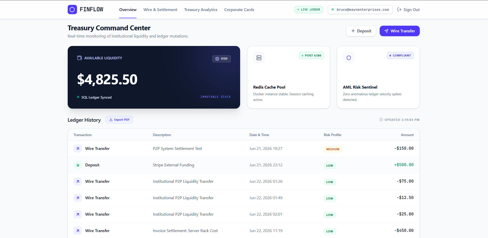
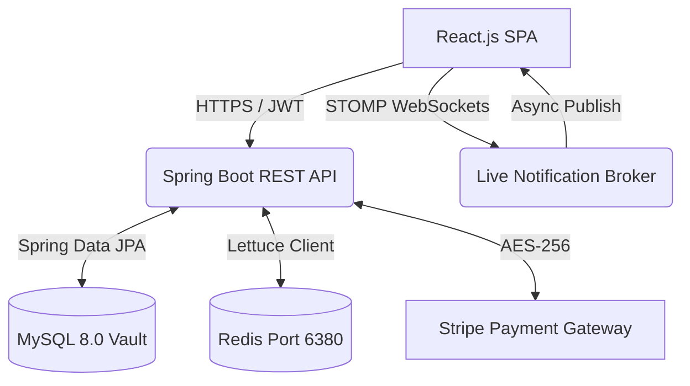

# 🏦 FINFLOW: Institutional Treasury & Ledger Platform


> **Live Demo:** [Insert Deployment Link Here]



An end-to-end distributed financial architecture delivering real-time double-entry bookkeeping, interactive ledger visualization, and automated risk scoring. Built to mimic enterprise-grade banking infrastructure with strict ACID compliance and stateless session security.

---

## 🏗 System Architecture

The platform utilizes a microservice-oriented design, orchestrating a React.js client against a Spring Boot REST API, backed by a Dockerized MySQL relational database and a Redis caching layer.



## 🛡️ Core Engineering Features

### 1. ACID-Compliant Transaction Engine

Peer-to-peer wire transfers are wrapped in strict `@Transactional` Spring constraints. If a sender's deduction succeeds but the receiver's deposit fails, the entire database transaction automatically rolls back to prevent mathematical drift or "ghost money."

### 2. High-Availability & Graceful Degradation

The application continuously probes the Redis cache cluster. If the Dockerized Redis node drops offline, the `LettuceConnectionFactory` gracefully degrades, falling back to direct MySQL queries to prevent catastrophic user-facing downtime.

### 3. Real-Time Telemetry (WebSockets)

Integrated Spring WebSockets with the STOMP protocol. When a B2B invoice is paid or a wire transfer settles, the server pushes an asynchronous event to the specific user's topic, triggering a live UI toast notification and ledger update without requiring a browser refresh.

### 4. OWASP Standard Security

* **Stateless JWT:** Role-Based Access Control (RBAC) enforced securely at the Spring Security filter chain.
* **Anti-Enumeration:** Registration and password recovery endpoints return generalized status codes to prevent malicious user-harvesting attacks at the unauthenticated layer.
* **BCrypt Hashing:** Cryptographic password storage preventing plaintext database leaks.

---

## 🛠️ Technology Stack

| Layer         | Technology                                          |
| ------------- | --------------------------------------------------- |
| Frontend      | React.js, Tailwind CSS, Recharts, Lucide Icons      |
| Backend       | Spring Boot 3.2, Spring Security, Spring WebSockets |
| Database      | MySQL 8.0, Spring Data JPA / Hibernate              |
| Caching       | Redis, Lettuce Client                               |
| External APIs | Stripe Payment Intent API                           |
| DevOps        | Docker Compose, Maven, Vite                         |

---

## 🚀 Local Development Quickstart

### Prerequisites

* Docker Desktop (Running)
* Java 17+ & Maven
* Node.js 18+
* Stripe Developer Account (For test API keys)

### 1. Environment Configuration

Before booting, configure your environment variables.

In `finflow-api/src/main/resources/application.properties`, set your Stripe Secret Key and a JWT Secret.

In `finflow-ui/.env`, set your Stripe Public Key:

```env
VITE_STRIPE_PUBLIC_KEY=pk_test_your_key_here
```

### 2. Spin Up Infrastructure

Navigate to the root workspace and boot the MySQL and Redis containers:

```bash
docker-compose up -d
```

### 3. Start the Spring Boot API

Open a terminal inside the `finflow-api` directory:

```bash
cd finflow-api
./mvnw spring-boot:run
```

The API will start on:

```text
http://localhost:8080
```

and auto-execute the Hibernate DDL schema generations.

### 4. Launch the React Client

Open another terminal inside the `finflow-ui` directory:

```bash
cd finflow-ui
npm install
npm run dev
```

The frontend will start on:

```text
http://localhost:5173
```

Navigate there to access the portal.

